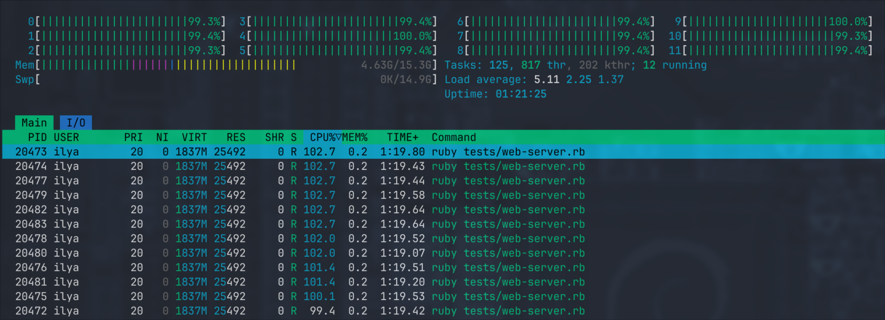
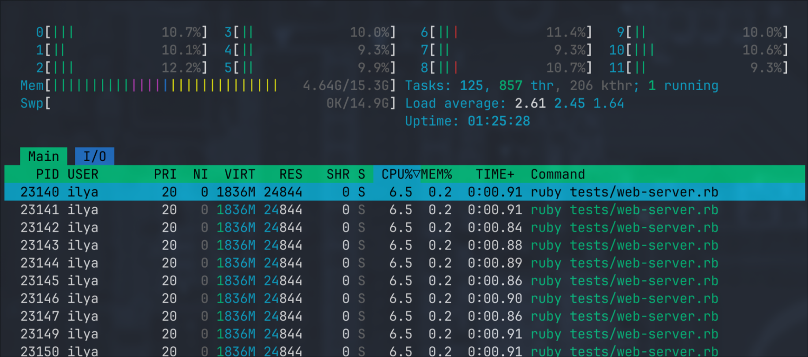

# Writing a Web Server

This is our destination point. We'll try to make a server that:

1. spawns a Ractor per core
2. starts a TCP server loop in the main thread
3. uses a shared queue to send incoming requests from the main thread to workers
4. parses a request in the worker, does some trivial routing and calls a request handler
5. uses a pool of "dummy" DB connections
6. writes a dynamic response back

First, we need a queue and a connection pool:

```ruby
QUEUE = CAtomics::MpmcQueue.new(16)

class DummyConnection
  def initialize(conn_id)
    @conn_id = conn_id
  end

  def read_data(id)
    {
      loaded_using_conn_id: @conn_id,
      id: id,
      name: "Record #{id}"
    }
  end
end

connections = 1.upto(16).map { |conn_id| DummyConnection.new(conn_id) }
DB_CONNECTION_POOL = CAtomics::FixedSizeObjectPool.new(16, 1_000) { connections.shift }
```

1. Queue's capacity is 16
2. Connection pool also consists of 16 dummy objects that simulate what a connection would do under the hood. You give it an input (`id` in our case) and it returns dynamic data based on it. Plus, it embeds an ID of the connection.
3. Connection pool has a 1s timeout, so if the pool is empty for more than 1 second it'll throw a timeout error.

Then we can start our workers:

```ruby
def log(s)
  $stderr.puts "[#{Ractor.current.name}] #{s}"
end

workers = 1.upto(CPU_COUNT).map do |i|
  puts "Starting worker-#{i}..."

  Ractor.new(name: "worker-#{i}") do
    while (conn = QUEUE.pop) do
      process_request(conn)
    end
    log "exiting..."
    Ractor.yield :done
  rescue Exception => e
    log e.class.name + " " + e.message + " " + e.backtrace.join("\n    ")
    Ractor.yield :crashed
  end
end
```

We'll use `nil` as a special terminating object that stops a Ractor from polling the queue.

Then we can add a signal handler for graceful shutdown:

```ruby
trap("SIGINT") do
  puts "Exiting..."
  CPU_COUNT.times { QUEUE.push(nil) }
  p workers.map(&:take)
  exit(0)
end
```

This handler pushes `nil` for each running Ractor which lets them process what's already in the queue but after that they'll stop.

And finally we can start our TCP server:

```ruby
server = Socket.tcp_server_loop(8080) do |conn, addr|
  # Got incoming connection, forwarding it to a worker...
  QUEUE.push(conn)
end
```

The only missing part is the `process_request(conn)` method:

```ruby
def process_request(conn)
  body = read_body(conn)
  http_method, path, protocol, headers, body = parse_body(body)

  log "#{http_method} #{path}"

  case [http_method, path]
  in ["GET", "/slow"]
    heavy_computation(100)
    reply(conn, 200, {}, "the endpoint is slow (100ms)")
  in ["GET", "/fast"]
    reply(conn, 200, {}, "yes, it's fast")
  in ["GET", /^\/dynamic\/(?<id>\d+)$/]
    id = Regexp.last_match[:id].to_i
    data = DB_CONNECTION_POOL.with { |db| db.read_data(id) }
    reply(conn, 200, {}, data.to_json)
  else
    reply(conn, 404, {}, "Unknown path #{path}")
  end
rescue Exception => e
  log e.class.name + " " + e.message + " " + e.backtrace.join("\n    ")

  reply(conn, 500, {}, "Internal server error")
ensure
  conn.close
end
```

> It doesn't really matter how we read and parse request body, but if you are curious feel free to take a look at the [full example](https://github.com/iliabylich/ractors-playground/blob/master/tests/web-server.rb#L30). In short, I'm reading from the socket with `read_nonblock` until there's nothing to read and then there's a dummy parser that can only handle HTTP 1 text-based format.
>
> We could re-use an existing library like `webrick` but I'm not sure if they can be called from non-main Ractors.

This server has 3 endpoints:

1. `/slow` - takes 100ms to execute, during all this time it does CPU-only work
2. `/fast` - replies immediately with a static payload
3. `/dynamic/:id` - "loads" the data from our fake database and returns dynamic response

It's absolutely OK it if looks ugly, I made it simple to take as few space as possible. Things like database connection that we've got from the pool can be easily placed in `Ractor.current[:database]` to make it globally accessible within the scope of request (so `User.find(<id>)` from ActiveRecord can still exist in this world).

When we run our script we get the following output:

```
$ ruby tests/web-server.rb
CPU count: 12
Starting worker-1...
Starting worker-2...
Starting worker-3...
Starting worker-4...
Starting worker-5...
Starting worker-6...
Starting worker-7...
Starting worker-8...
Starting worker-9...
Starting worker-10...
Starting worker-11...
Starting worker-12...
Starting server...
```

And each endpoint also works fine.

### fast

```
$ curl http://localhost:8080/fast
yes, it's fast

# => [worker-6] GET /fast
```

### slow

```
$ curl http://localhost:8080/slow
the endpoint is slow (100ms)

# => [worker-1] GET /slow
```

### dynamic

```
$ curl http://localhost:8080/dynamic/42
{"loaded_using_conn_id":1,"id":42,"name":"Record 42"}
$ curl http://localhost:8080/dynamic/17
{"loaded_using_conn_id":2,"id":17,"name":"Record 17"}

# => [worker-4] GET /dynamic/42
# => [worker-7] GET /dynamic/17
```

## a bit of stress testing

Let's see if it survives if we send more requests (each takes 100ms of pure computations):

```
$ ab -c12 -n1000 http://localhost:8080/slow
// ...
Completed 900 requests
Completed 1000 requests

Concurrency Level:      12
Time taken for tests:   8.536 seconds
Complete requests:      1000
Failed requests:        0
Total transferred:      67000 bytes
HTML transferred:       28000 bytes
Requests per second:    117.16 [#/sec] (mean)
Time per request:       102.427 [ms] (mean)
Time per request:       8.536 [ms] (mean, across all concurrent requests)
Transfer rate:          7.67 [Kbytes/sec] received
```

and meawhile we get a nice picture in Htop:



Once `ab` is done the process goes back to idle:


