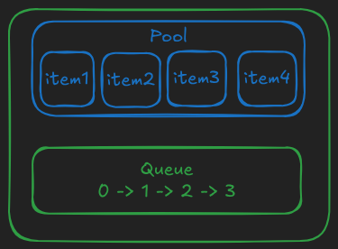
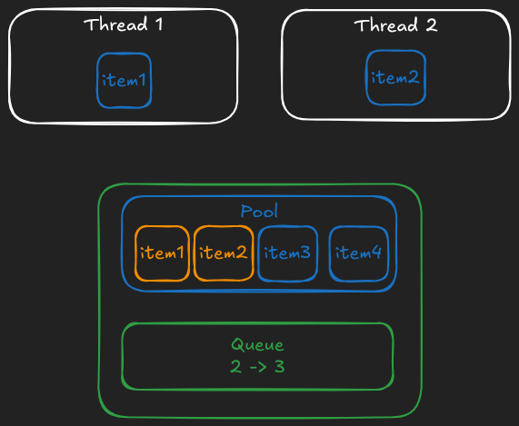
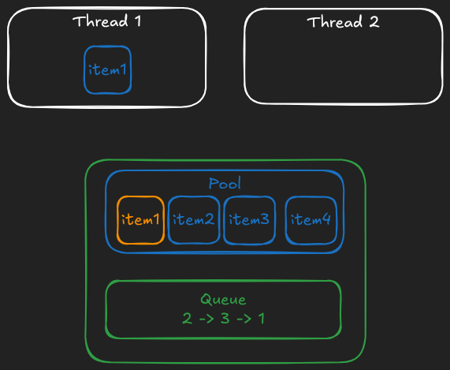

# Concurrent ObjectPool

That's a pretty common pattern in multi-threaded apps in case you need:

1. something like a connection pool for your database or any kind of external storage service
2. maybe a pool of persistent connections for an external service if it has rate limits
3. a pool of workers threads
4. or maybe even a pool of pre-allocated buffers that are reused for heavy data loading

So let's think about the interface first, how about this?

```ruby
size = 5
timeout_in_ms = 3_000
def make_object
  # connect to the DB and return connection
end
pool = OurObjectPool.new(size, timeout_in_ms) { make_object }

pool.with do |connection|
  # do something with `connection`
end
# the object is automatically returned to the pool once the block exits
```

> Having a timeout is a must for a database connection pool in real-world apps, but if it's a pool of workers in some cases it doesn't make sense, so I think it can be made optional so that if it's not passed then no timeout error should occur. I'm going with a non-flexible approach here, timeout configuration will be a required parameter.

## Another data structure, another Rust dependency

After all, that was the reason I chose Rust here.

[`crossbeam_channel`](https://crates.io/crates/crossbeam_channel) is a Rust library for multi-producer multi-consumer queues, with timeout support. Why do we need it here? Good question.

We can store the pool as a plain array of objects and keep track of all "unused" indexes in the queue (in any order), so that when you call `.checkout` it'll `.pop` from the queue and return `[obj, idx]`, and you call `.checkin(idx)` it'll push it back to the queue. Of course, initially the queue should be filled with all available indexes from `0` to `POOL_SIZE`.

Internally it can be visualized as this:



+ green items are safe for direct usage by multiple threads
+ blue items are not safe, but access to them is protected by green items

Here's how it looks when 2 threads temporarily pop the value (orange values are still in the pool, but no thread can take it because its index is not in the queue):



And finally this is what happens when the second thread returns the value back to the pool:



This way each object will be either in the "unused" queue (implicitly, via its index) or in use by exactly one thread. And no synchronization of the underlying array is needed. That's the beauty of using existing ecosystem of great libraries.

```rust
use crossbeam_channel::{Receiver, Sender};
use std::{ffi::c_ulong, time::Duration};

// This is the pool itself
pub struct FixedSizeObjectPool {
    // a fixed-size array, as a Vec because we know its size only at runtime
    // however it never resizes
    pool: Vec<c_ulong>,
    // "sending" part of the queue (that we "push" to)
    tx: Sender<usize>,
    // "receiving" part of the queue (that we "pop" from)
    rx: Receiver<usize>,
    timeout: Duration,
}

// We need to return a combination of `idx` and `object` from `.checkout` method,
// so this struct simply represents it
#[repr(C)]
pub struct PooledItem {
    pub idx: usize,
    pub rbobj: c_ulong,
}

impl FixedSizeObjectPool {
    // Exposed as `FixedSizeObjectPool.allocate` in Ruby
    fn new() -> Self {
        let (tx, rx) = crossbeam_channel::unbounded();

        Self {
            pool: vec![],
            tx,
            rx,
            timeout: Duration::MAX,
        }
    }

    // Exposed as `FixedSizeObjectPool#initialize` in Ruby
    fn init(
        &mut self,
        size: usize,
        timeout_in_ms: u64,
        rb_make_obj: extern "C" fn(c_ulong) -> c_ulong,
    ) {
        self.timeout = Duration::from_millis(timeout_in_ms);

        self.pool = Vec::with_capacity(size);
        for idx in 0..size {
            self.pool.push((rb_make_obj)(0));
            self.tx.send(idx).unwrap();
        }
    }

    // Our standard "marking" routine, similar to the one we had for DashMap
    fn mark(&self, f: extern "C" fn(c_ulong)) {
        for item in self.pool.iter() {
            f(*item);
        }
    }

    // Exposed as `FixedSizeObjectPool#checkout` in Ruby
    fn checkout(&mut self) -> Option<PooledItem> {
        let idx = self.rx.recv_timeout(self.timeout).ok()?;
        Some(PooledItem {
            idx,
            rbobj: self.pool[idx],
        })
    }

    // Exposed as `FixedSizeObjectPool#checkin` in Ruby
    fn checkin(&mut self, idx: usize) {
        self.tx.send(idx).expect("bug: receiver has been dropped");
    }
}
```

Then the only unusual part is error handling around `checkout` method:

```rust
#[no_mangle]
pub unsafe extern "C" fn fixed_size_object_pool_checkout(pool: *mut FixedSizeObjectPool) -> PooledItem {
    let pool = unsafe { pool.as_mut().unwrap() };
    pool.checkout().unwrap_or(PooledItem { idx: 0, rbobj: 0 })
}
```

So if we get a timeout error we return `[0, 0]` pair as `[obj, idx]`. And then in C we can do:

```c
VALUE rb_fixed_size_object_pool_checkout(VALUE self) {
  fixed_size_object_pool_t *pool;
  TypedData_Get_Struct(self, fixed_size_object_pool_t, &fixed_size_object_pool_data, pool);
  PooledItem pooled = fixed_size_object_pool_checkout(pool);
  if (pooled.idx == 0 && pooled.rbobj == 0) {
    return Qnil;
  }
  VALUE ary = rb_ary_new_capa(2);
  rb_ary_push(ary, pooled.rbobj);
  rb_ary_push(ary, LONG2FIX(pooled.idx));
  return ary;
}
```

Which either returns `[obj, idx]` literally as an array of two elements or returns `nil` otherwise.

With these `.checkout` and `.checkin` methods we can build a wrapper:

```ruby
module CAtomics
  class FixedSizeObjectPool
    def with
      obj_and_idx = checkout
      if obj_and_idx.nil?
        raise 'timeout error'
      else
        yield obj_and_idx[0]
      end
    ensure
      unless obj_and_idx.nil?
        checkin(obj_and_idx[1])
      end
    end
  end
end
```

Does this work?

```ruby
POOL_SIZE = 5
objects = 1.upto(POOL_SIZE).map { |i| ["pool-object-#{i}"] }
POOL = CAtomics::FixedSizeObjectPool.new(POOL_SIZE, 1_000) { objects.shift }

ractors = 1.upto(POOL_SIZE).map do |i|
  Ractor.new(i) do |i|
    10.times do |j|
      POOL.with do |v|
        v.push([i, j])
      end
    end

    Ractor.yield :done
  end
end

p ractors.map(&:take)
# => [:done, :done, :done, :done, :done]

POOL_SIZE.times do
  p POOL.checkout
end
# => [["pool-object-1", [1, 0], [2, 3], [1, 5], [1, 7], [3, 0], [3, 5], [4, 0], [4, 5], [5, 0], [5, 5]], 0]
# => [["pool-object-2", [2, 0], [1, 2], [2, 5], [2, 8], [3, 1], [3, 6], [4, 1], [4, 6], [5, 1], [5, 6]], 1]
# => [["pool-object-3", [1, 1], [2, 4], [2, 6], [1, 8], [3, 2], [3, 7], [4, 2], [4, 7], [5, 2], [5, 7]], 2]
# => [["pool-object-4", [2, 1], [1, 3], [1, 6], [2, 9], [3, 3], [3, 8], [4, 3], [4, 8], [5, 3], [5, 8]], 3]
# => [["pool-object-5", [2, 2], [1, 4], [2, 7], [1, 9], [3, 4], [3, 9], [4, 4], [4, 9], [5, 4], [5, 9]], 4]

POOL.with { |obj| }
# => c_atomics/lib/c_atomics.rb:24:in 'CAtomics::FixedSizeObjectPool#with': timeout error (RuntimeError)
# =>    from tests/fixed-size-object-pool.rb:23:in '<main>'
```

As you can see each object in our pool (which is an array that accumulates values from different Ractors) has been used by 5 different threads, and when we take all items from the pool at the end (using `.checkout`) and call `.with` again on an empty pool, then it throws an error after 1 second.
